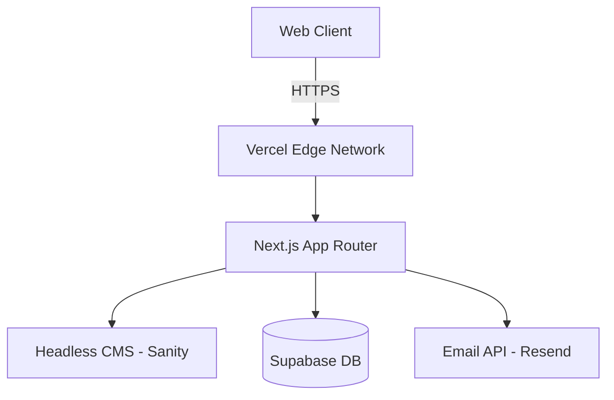

# Next.js Enterprise Upgrade Roadmap

## Architecture Diagram


## Migration Plan

1. **Bootstrap Next.js:** Run `npx create-next-app@latest soham-trading --typescript --tailwind --eslint --app`.
2. **Move Assets:** Transfer `/images` to `/public/images`. Next.js `<Image>` component will automatically handle WebP conversion and lazy loading.
3. **Componentization:**
   - Convert `index.html` sections into React Server Components (e.g., `<Hero />`, `<Services />`, `<Contact />`).
   - Use `Framer Motion` for canvas and scroll animations instead of vanilla IntersectionObservers.
4. **Data Fetching:** Move `services.json` to CMS or keep it locally and fetch via Server Components.
5. **API Routes:** Replace the static form submission with a Next.js Server Action connecting to an email service.

## Recommended Folder Structure
```text
/app
  /components
    /ui
    /layout
  /lib
    utils.ts
  /api
    /contact
      route.ts
  page.tsx
  layout.tsx
  global.css
```
